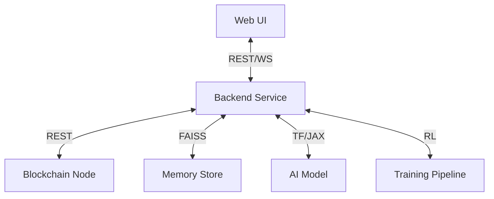

# LocalGPT: Blockchain-Powered AI Assistant

A local, end-to-end AI assistant prototype with blockchain-based memory and reinforcement learning capabilities.

## Features

- 🏦 Local blockchain with native token support
- 🧠 On-chain memory system with semantic search
- 🤖 Fine-tunable AI model with reinforcement learning
- 💬 Modern web-based chat interface
- 🔒 Privacy-focused local-first architecture
- 🐳 Containerized with Docker (CPU/GPU support)

## Architecture



## Prerequisites

- Docker and Docker Compose
- Python 3.9+
- Node.js 16+ (for UI development)
- (Optional) NVIDIA GPU with drivers and NVIDIA Container Toolkit

## Quick Start

1. Clone the repository:
   ```bash
   git clone https://github.com/yourusername/localgpt.git
   cd localgpt
   ```

2. Copy the example environment file:
   ```bash
   cp .env.example .env
   ```

3. Start the services (CPU):
   ```bash
   docker-compose up -d
   ```

4. Access the UI at http://localhost:3000

## GPU Support

To enable GPU support:

1. Ensure you have NVIDIA drivers and NVIDIA Container Toolkit installed
2. Start services with GPU support:
   ```bash
   docker-compose -f docker-compose.yml -f docker-compose.gpu.yml up -d
   ```

## Project Structure

- `blockchain/` - Local blockchain node and wallet implementation
- `backend/` - AI model service and memory system
- `ui/` - React-based web interface
- `scripts/` - Utility and setup scripts
- `docker/` - Docker-related configurations

## Development

### Setting Up Local Development

1. Install Python dependencies:
   ```bash
   python -m venv venv
   source venv/bin/activate  # On Windows: .\venv\Scripts\activate
   pip install -r requirements-dev.txt
   ```

2. Install Node.js dependencies:
   ```bash
   cd ui
   npm install
   ```

### Running Tests

```bash
# Run blockchain tests
cd blockchain
pytest

# Run backend tests
cd ../backend
pytest
```

## License

MIT

## Contributing

Contributions are welcome! Please read our contributing guidelines before submitting pull requests.

## Docker commands
# Stop and remove any existing containers
docker-compose down -v

# Clean up Docker system
docker system prune -f
docker volume prune -f

# Rebuild and start the services
docker-compose up --build